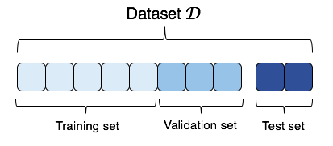

```{r setup, include = FALSE}
knitr::opts_chunk$set(
  collapse = TRUE,
  comment = "#>"
)
```

The examples in the regularization vignette (`regularization.Rmd`) included cross-validation to objectively find the optimal penalty in regulator fund, but these cross-validation routines happened behind the scenes.
So here we provide two coded examples:

1. Out-of-sample validation: we hold out a chunk of data completely for scoring a model's predictive ability
2. Cross-validation: we iteratively hold out different chunks of data for scoring the model's predictive ability.

Out-of-sample validation is the best measure of a model's predictive ability, but in ecology we often do not have data sets that are large enough to split out an out-of-sample set. 
This is why we often rely on cross-validation: it approximates out-of-sample validation without having to give up any data in the model fitting process.

In the ideal situation, predictive models should be fit and tested using three sets of the data: a **training set**, a **validation set**, and a **test set**.
The training set is used to actually fit the model coefficients.
The validation set is used to tune the regularization parameters and/or to compare among potential models.
And the test set is used to provide a predictive score for the final fitted model; it plays no role in the model fitting process.
It is rare in ecology to have enough data to even set aside a validation set, so having an independent test set is virtually unheard of.
As ecology moves to becoming a more predictive science, however, ecologists will need to devote resources to obtaining data sets large enough to split into the three sets.



In the examples below, we just fit simple linear models and compare two models: one with a climate covariate and population size, and one with just population size.

##  Out-of-sample (oos) validation
```{r, fig.width=6, eval=TRUE}
# Set seed and load packages ---------------------------------------------------

set.seed(12345)
library(modselr)
library(tidyverse)


# Subset out fitting data ------------------------------------------------------

# Randomly sample 20% of the years for oos validation
all_years <- unique(butterfly$year)
all_years <- all_years[which(!(all_years %in% c(2014,2015)))] # drop 2014 and 2015 from analysis
num_oos   <- round(length(all_years)*0.2)
oos_years <- sample(x = all_years, size = num_oos, replace = FALSE)

# Get one subpopulation define training/validation sets
sub_pop <- butterfly %>%
  filter(meada == 'L', year < 2014) %>%
  select(year, Rt, logNt, novextmax) %>%
  mutate(
    model_set = ifelse(year %in% oos_years, "validation", "training")
  )

training_data <- sub_pop %>%
  filter(model_set == "training")

validation_data <- sub_pop %>%
  filter(model_set == "validation")


# Fit the two models and make predictions --------------------------------------

clim_mod   <- lm(Rt ~ logNt + novextmax, data = training_data)
noclim_mod <- lm(Rt ~ logNt, data = training_data)

clim_preds   <- predict(clim_mod, newdata = validation_data)
noclim_preds <- predict(noclim_mod, newdata = validation_data)


# Calculate Mean Square Error of the oos predictions ---------------------------

mse_clim   <- mean((clim_preds - validation_data$Rt)^2)
mse_noclim <- mean((noclim_preds - validation_data$Rt)^2)

mse_df <- data.frame(Model = c("Climate", "No Climate"),
                     MSE = round(c(mse_clim, mse_noclim),2),
                     AIC = round(c(AIC(clim_mod), AIC(noclim_mod)),2))

knitr::kable(mse_df)
```

## Cross-validation
Cross-validation is the workhorse for fitting optimally predictive models to small datasets, which is why it is a common technique in the ecology literature.
There are two reasons why we might prefer cross-validation when working with small datasets:

1. Results from out-of-sample validation can be unstable for small datasets because the held out data might not comprise a large enough sample to be representative of the dataset as a whole. In other words, we might get different results if we hold out different sets of the data. This is not desirable.
2. We don't want to lose any data that might help us estimate precise model parameters -- holding out data completely reduces our sample size by a lot.

Here we show a simple example, using the same models as above, fit iteratively leaving out one observation year, fitting the model, and then predicting the left out year.
This will leave us with a distribution of MSE values for each model, one MSE for each left out year.
Our example is called "leave-one-out" (loo) cross-validation.
Another option is to hold out "folds" of data, creating *K* sets of held out data.
See the `glmmLasso` example in the `regularization.Rmd` vignette for an example of *K*-fold cross-validation.

```{r, fig.width=4, eval=TRUE}
# Get one subpopulation --------------------------------------------------------

sub_pop <- butterfly %>%
  filter(meada == 'L', year < 2014) %>%
  select(year, Rt, logNt, novextmax) 


# Loop through each year, leave out and make predictions -----------------------

all_years <- unique(sub_pop)$year
out_df <- {} # empty object for storage

for(doyear in all_years){
  # Split data
  training_data <- sub_pop %>%
    filter(year != doyear)
  
  validation_data <- sub_pop %>%
    filter(year == doyear)
  
  # Fit models
  clim_mod   <- lm(Rt ~ logNt + novextmax, data = training_data)
  noclim_mod <- lm(Rt ~ logNt, data = training_data)
  
  # Make predictions
  clim_preds   <- predict(clim_mod, newdata = validation_data)
  noclim_preds <- predict(noclim_mod, newdata = validation_data)
  
  # Calculate MSEs
  mse_clim   <- mean((clim_preds - validation_data$Rt)^2)
  mse_noclim <- mean((noclim_preds - validation_data$Rt)^2)
  
  # Save the results (and AIC, for fun)
  tmp_df <- data.frame(Model = c("Climate", "No Climate"),
                       MSE = round(c(mse_clim, mse_noclim),2),
                       AIC = round(c(AIC(clim_mod), AIC(noclim_mod)),2),
                       OutYear = doyear)
  
  out_df <- rbind(out_df, tmp_df)
}


# Plot the MSE values ----------------------------------------------------------
ggplot(out_df, aes(y = MSE, x = Model))+
  geom_boxplot()


# Sum MSE over the left out years ----------------------------------------------
out_df %>%
  group_by(Model) %>%
  summarise(Summed_MSE = round(sum(MSE),3)) %>%
  knitr::kable()


```
